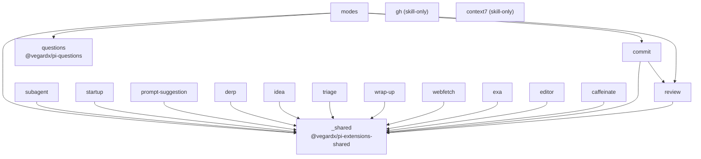
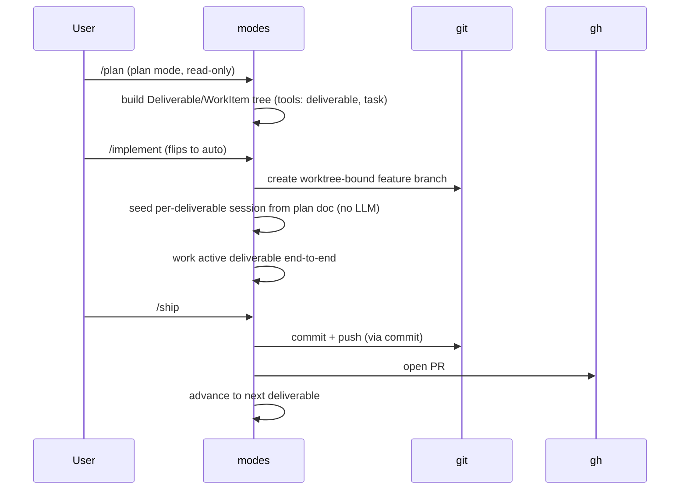
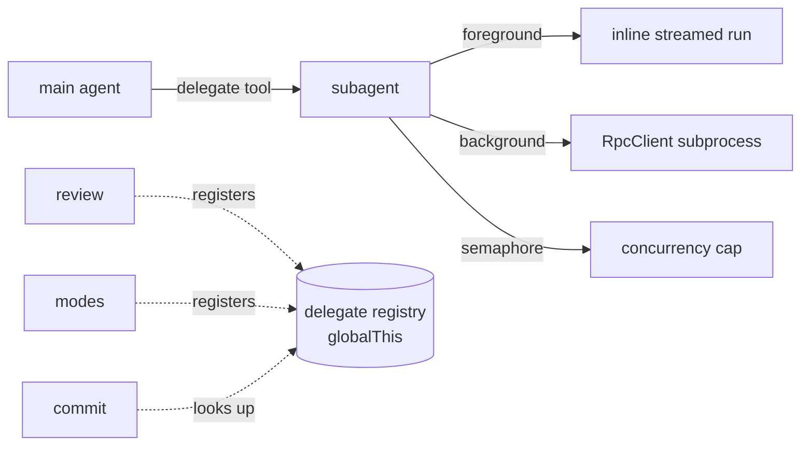
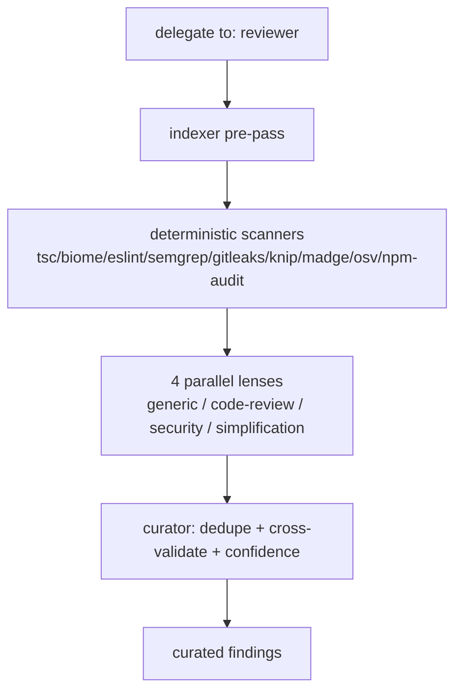

# Current-state architecture overview

A reference for what the `pi-extensions` monorepo does today — package
inventory, dependency graph, runtime flows, persistence, public surface,
tooling, and known drift. Written so a reader can understand the repo
without opening source files. Snapshot date: 2026-06-24.

> This documents the **existing** repo. The forward-looking rewrite
> (`pi-maestro`) is tracked separately in the plan; nothing here describes
> that target design.

## 1. What this repo is

A personal [pi](https://github.com/badlogic/pi-mono) extension stack: an npm
workspaces monorepo, one extension (or skill, or shared library) per package
under `packages/*`. No build step — pi loads `.ts` at runtime via jiti. The
root `package.json` declares `workspaces: ["packages/*"]`; each package
carries its own `pi` manifest block (`extensions` / `skills`).

Three package kinds:

- **Extension** — has a `pi.extensions` entry (`./index.ts`) wrapped in
  `defineExtension(...)`; registers commands/tools/events/shortcuts.
- **Skill-only** — has a `pi.skills` entry but no extension code.
- **Library** — no `pi` registration; imported by other packages
  (`@vegardx/pi-extensions-shared`, `@vegardx/pi-questions`).

pi host packages (`@mariozechner/pi-coding-agent`, `-pi-ai`, `-pi-tui`,
`@sinclair/typebox`) are always `peerDependencies: "*"` — never bundled.

## 2. Package inventory

| Package | npm name | Kind | Surface | Notes |
|---|---|---|---|---|
| `modes` | `pi-ext-modes` | Extension + skills | `/plan /implement /ship /sync /park /scrutinize /modes-status /sidebar /notes /worktree`; tools `deliverable` `task` `plan` `ask` | The centerpiece. `index.ts` ≈ 6.2k lines. Skills: diagnose, document, improve, propose-skill |
| `review` | `pi-ext-review` | Extension + skills | `reviewer` delegate target (no command) | Multi-lens review pipeline + scanners. Skills: code-review, security, simplification, generic |
| `commit` | `pi-ext-commit` | Extension + skill | `/commit` | Conventional-commit workflow → PR. Skill: commit |
| `subagent` | `pi-ext-subagent` | Extension | `delegate` / subagent tools | Foreground/background delegation, semaphore, jobs |
| `startup` | `pi-ext-startup` | Extension | `/config` | Startup config dialog (extensions/knobs/models/context) |
| `prompt-suggestion` | `pi-ext-prompt-suggestion` | Extension | tool `suggest_next_prompt` | Next-prompt ghost text via hidden terminating tool |
| `derp` | `pi-ext-derp` | Extension | crash/issue capture | Files GitHub issues incl. crash reports |
| `idea` | `pi-ext-idea` | Extension | idea capture | Lightweight issue/idea filing |
| `triage` | `pi-ext-triage` | Extension + skill | triage workflow | GitHub inbox triage. Skill: triage |
| `wrap-up` | `pi-ext-wrap-up` | Extension | session handover | Discover + summarize work |
| `webfetch` | `pi-ext-webfetch` | Extension | tool `webfetch` | URL → clean markdown (`defuddle`) |
| `exa` | `pi-ext-exa` | Extension + skill | tool `websearch` | Exa search (`exa-js`). Skill: exa-search |
| `editor` | `pi-ext-editor` | Extension | external `$EDITOR` integration | |
| `caffeinate` | `pi-ext-caffeinate` | Extension | keep-awake | Minimal template reference |
| `gh` | `pi-ext-gh` | Skill-only | — | gh CLI conventions + multi-host routing |
| `context7` | `pi-ext-context7` | Skill-only | — | Library docs lookup |
| `questions` | `@vegardx/pi-questions` | Library (TUI) | questionnaire dialog/state | Consumed by `modes` |
| `_shared` | `@vegardx/pi-extensions-shared` | Library | define-extension, settings, model-resolver, shell, git, gh, etc. | The common junk drawer |

18 packages: 14 extensions, 2 skill-only, 2 libraries.

## 3. Dependency graph

Notable: `modes` statically depends on `commit`, `review`, and
`@vegardx/pi-questions` (peerDeps). `commit` depends on `review`. Everything
funnels through `_shared`. This static coupling between sibling extensions is
the main structural tension (see §8).

Cross-extension *runtime* calls that are not static imports go through the
**delegate registry** (`_shared/delegate-registry.ts`, a `globalThis`-anchored
map): `review` registers the `reviewer` target; `modes` registers its targets;
`commit` and `modes/worker-review` look targets up at runtime.

## 4. Core runtime flows

### 4.1 Modes: plan → implement → ship

Permission modes cycle with Shift+Tab: `hack → plan → ask → auto`. Plan mode
exposes a read-only tool set plus the plan tools; a bash read-only classifier
gates shell commands. Each deliverable runs in its own pi session, seeded
deterministically from the plan doc. Three-tier compaction: mid-execution,
per-deliverable summary, and plan-doc seed.

Plan persistence: `<agentDir>/plans` (v3 schema). Status state machine:
`planned → active → in-review → ready-to-ship → shipped`, plus
`needs-attention` and `abandoned`. Multi-session support exists today
(lockfile plan store, driver-claim, peer sessions, `--fanout` fleet via
`FleetManager` + `WorkerMailbox`).

### 4.2 Delegation / subagents

`subagent` runs delegated agents foreground (inline) or background
(subprocess via RpcClient), under a shared concurrency semaphore. `modes`
fanout execution has its **own** parallel run transport
(`FleetManager`/`WorkerMailbox`/`explore-mailbox`/`worker-mailbox`) rather
than reusing `subagent` — duplicated orchestration machinery.

### 4.3 Review pipeline

Invoked only via `delegate({to: "reviewer"})` — no slash command. `/commit`
offers it pre-commit and walks the curated findings.

### 4.4 Commit → PR

`commit/core.ts` (≈600 lines): stages explicit paths, generates the message
via an agent turn (listener-based idle wait, since it runs outside a command
context), commits, pushes with fork-aware routing + head-drift handling, and
creates/updates the PR via the gh wrapper. Auto-appends `Closes #N` from
branch tracking-issue config. `modes` `/ship` reuses this path
non-interactively.

### 4.5 Issue filing (derp / idea)

Both file GitHub issues via `_shared/issue-filer.ts` + `gh-issue.ts`. `derp`
additionally captures crash reports (process-level snapshots, redacted via
`_shared/redact.ts`). `idea` is the lighter-weight capture path.

### 4.6 Startup `/config`

`startup` renders a multi-section config dialog (`config-dialog/dialog.ts`,
≈1.2k lines): extensions on/off, sub-feature knobs, background-model
selection, and context-file discovery — writing through
`_shared/settings-writer.ts`.

### 4.7 Background model resolution

`_shared/model-resolver.ts` resolves a model for background work across
tiers (`fast`/`normal`/`heavy`). Consumed by `modes`, `review`, `derp`,
`idea`, `triage`, `webfetch`, `startup`. Resolution walks explicit override →
`extensionConfig.<name>.model` → `backgroundModels.<tier>` → primary fallback.

## 5. Persistence locations

All under the pi agent dir (`PI_CODING_AGENT_DIR` / XDG-resolved `agentDir`):

- `<agentDir>/plans` — modes plan store (v3 schema), with lockfile for
  multi-session.
- `<agentDir>/sessions` — per-deliverable seeded sessions.
- crash reports — written by `derp` (redacted snapshots).
- Settings — layered config read via `_shared/extension-settings.ts`,
  written via `_shared/settings-writer.ts` (raw JSON, non-atomic — see §8).

## 6. Public surface

**Commands:** `/plan` `/implement` `/ship` `/sync` `/park` `/scrutinize`
`/modes-status` `/sidebar` `/notes` `/worktree` (all `modes`); `/config`
(`startup`); `/commit` (`commit`).

**Tools:** `deliverable` `task` `plan` `ask` (`modes`); `websearch` (`exa`);
`webfetch` (`webfetch`); `suggest_next_prompt` (`prompt-suggestion`);
`delegate`/subagent tools (`subagent`).

**Delegate targets:** `reviewer` (`review`); modes targets (`modes`).

**Skills (13):** commit, context7, exa-search, gh, modes/{diagnose,
document, improve, propose-skill}, review/{code-review, security,
simplification, generic}, triage.

## 7. Tests & tooling

- **Tests:** 131 test files, ≈2,040 cases (vitest, `globals: true`). Heavy
  coverage in `modes` (~45 files), `review` (~25, incl. per-scanner),
  `startup`, `_shared`, `commit`, `derp`.
- **`npm run check`:** `biome check . && tsc --noEmit && node
  scripts/check-cross-extension-imports.mjs && vitest run`.
- **Boundary linter:** `scripts/check-cross-extension-imports.mjs` blocks
  static *value* imports between sibling `pi-ext-*` packages (type-only OK).
- **Contract test:** `_shared/__tests__/env-disable-contract.test.ts` —
  every retrofitted extension must honour its env-disable toggle.
- **Formatting/lint:** Biome (tabs, double quotes, 80-col); `noExplicitAny`
  off for loose event payloads.
- **CI** (`.github/workflows/ci.yml`): `check` job (lint+typecheck+test) on
  push/PR; `release` job runs **semantic-release** on push to `main`.
- **TypeScript:** strict, ES2022, Node16 resolution, `noEmit`.

## 8. Known health issues & drift

- **`modes/index.ts` ≈ 6,202 lines** — the dominant hotspot; mixes mode
  state, plan engine wiring, execution, UI, and command registration in one
  file.
- **Duplicated git/gh wrappers** — separate `git.ts`/`gh.ts` in `commit`,
  `modes`, `review`, `triage`, `derp`, plus `_shared/git-origin.ts` and
  `_shared/shell.ts`. No single typed git/gh seam.
- **Two run transports** — `subagent` has a delegation runtime; `modes` has a
  separate `FleetManager`/`WorkerMailbox`/`explore-mailbox` fanout pool. The
  same job (run a child agent, stream progress) is implemented twice.
- **`globalThis` registries** — delegate registry and extension-metadata
  registry are anchored on `globalThis`; entries can go stale after a session
  is replaced (no dispose-on-shutdown).
- **Static sibling coupling** — `modes` statically imports `commit`,
  `review`, `@vegardx/pi-questions`; `commit` imports `review`. The boundary
  linter only blocks *new* value imports; existing peerDep coupling remains.
- **Non-atomic settings writes** — `_shared/settings-writer.ts` writes raw
  JSON without atomic replace or locking.
- **`_shared` is a junk drawer** — 19 unrelated modules (settings, models,
  shell, git, gh, mailbox, redact, notify, polish, caffeinate…) with no
  internal layering.
- **README / schema terminology drift** — `README.md` describes the plan
  model as **"phase/task"** (14 "phase" mentions, 0 "deliverable"), but the
  actual v3 schema (`packages/modes/plan/schema.ts`) is
  **Deliverable / WorkItem** with `DeliverableStatus`. The user-facing docs
  lag the code's vocabulary.
- **CI release mismatch vs intent** — CI runs `semantic-release`, while the
  stated model elsewhere is lockstep single-version tagging; the two are not
  reconciled in-repo.
