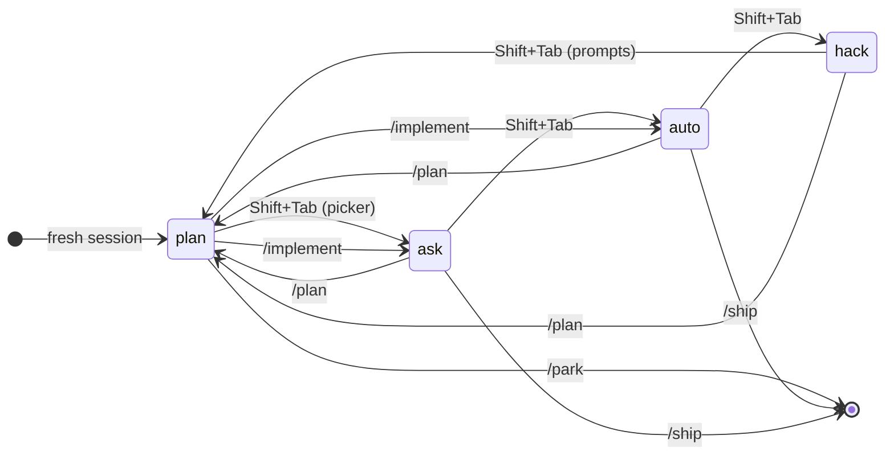

# modes

Permission-mode cycle with phase/task plan model and worktree-bound execution. Replaces `/develop`.

## Modes

| Mode | Tools | Bash | Confirmation | Plan needed | Compaction |
|------|------|------|--------------|-------------|------------|
| `hack` | all | all | none — full tool access | no | none — user owns context length |
| `plan` | read-only (`read`, `bash`, `grep`, `find`, `ls`, `websearch`, `webfetch`, `plan_phase`, `plan_task`, `plan_view`, `explore_ask`, `explore_check`, `explore_wait`, `research`) | blocked if write-capable | none — writes are refused outright | — (creates one) | — |
| `ask` | all | all | none during execution; the post-exec picker pauses you at the commit/ship boundary | yes (works the active phase) | three-tier (plan→implement, mid-phase, phase-end) |
| `auto` | all | all | none — fully autonomous; commits, ships, advances phases without prompting | yes (works the active phase) | three-tier (plan→implement, mid-phase, phase-end) |

Current mode is shown in the footer (`hack` renders red — no safety net; `ask` renders green — supervised; `auto` renders accent). **Shift+Tab** cycles `hack → plan → ask → auto → hack`. The cycle adds structure step by step, then drops it again.

- `hack → plan`: prompts for handling carried-over context (keep / lossy-compact the active phase). Headless skips the prompt and silently keeps context.
- `plan → ask`: opens the picker (Implement (auto) / Implement (ask) / Park / Continue discussing) when a plan is in flight; otherwise just flips. The picker forces an explicit `/implement` so you don't stumble into execution with stale plan text.
- `ask → auto`: flips silently — going more permissive, context flows through.
- `auto → hack`: flips silently — going more permissive, context flows through.

Fresh sessions start in the mode chosen by `extensionConfig.modes.defaultMode` (default `plan`). Existing persisted sessions always use their saved mode.

### Mode transitions



Two edges open a picker; everything else flips silently — including `/implement`, which starts execution with no confirmation step:

- `hack → plan` (Shift+Tab) — carry-over context: keep or lossy-compact the active phase. Skipped headless.
- `plan → ask` (Shift+Tab, when a plan is in flight) — Implement (auto) / Implement (ask) / Park / Continue discussing.

Session-restore boundaries (full table under [Session model](#session-model)):

| Transition | Session |
| --- | --- |
| `/plan` (any source) and `Shift+Tab` to plan | `switchSession(plan.planSessionPath)` |
| `/implement` first time on a phase | NEW auto session, seeded from the plan doc |
| `/implement` resume (`active` / `needs-attention`) | `switchSession(phase.sessionPath)` |
| `Shift+Tab` between `hack`, `ask`, `auto` | (no session change) |
| `/ship` | (no session change) — commits, pushes, opens PR |

Compaction & seed touchpoints:

- `/implement` writes a deterministic plan-doc **seed** into the new auto session — no LLM call. See [Per-phase session seeding](#per-phase-session-seeding).
- In `auto` and `ask`, **mid-phase compaction** fires from `turn_end` when `sys + work` exceeds `compaction.workingTokens`. `plan` mode is exempt — the human is in the loop.
- `/ship` summarises the auto session into `phase.summary`; the next phase's seed inlines all prior shipped phases' summaries verbatim. See [Cross-phase carry-forward](#cross-phase-carry-forward).


### Choosing a mode at /implement

When you commit to a plan via the picker (Shift+Tab plan→ask) or `/implement`, two implement options are offered:

- **Implement (auto)** — chug through the plan end-to-end. After each phase completes, auto-mode runs `/commit` (non-interactive) → `/ship` → `/implement` for the next planned phase, all without prompting. Auto does NOT wait between phases for PR review — review feedback arrives async, and the **end-of-plan PR sweep** is when you address it (see below).
- **Implement (ask)** — execute the phase's tasks autonomously, then pause at the commit/ship boundary so you can review the diff before it ships. Same mid-phase compaction and steering classifier as auto; the difference is purely at the git boundary.

`extensionConfig.modes.implementDefault` (default `auto`) controls which option is highlighted first — set it to `ask` if you prefer human-in-the-loop by default.

When `/implement` is invoked from `ask` or `auto` mode it preserves that mode rather than reading the setting. This means a scripted `ask → /implement` flow stays in ask without any config change. `hack` mode maps to `auto` (ImplementMode excludes hack). Use `/hack`, `/ask`, or `/auto` to flip modes without going through the implement flow.

### End-of-plan PR sweep

When `/ship` lands the last actionable phase of a plan (auto or manual), modes runs a PR sweep before showing the completion picker. For every phase with a `prNumber`, it queries `gh pr view` for state, CI rollup, and review decision, and renders a single summary like:

```
Plan complete — PR sweep:
  ✓ Phase `add-webhook`           PR #142  merged, CI green, approved
  · Phase `validate-signatures`   PR #145  open, CI green, CHANGES_REQUESTED, 3 unresolved comments
  · Phase `retry-failed`          PR #148  open, CI failing
```

If any PR needs attention, the completion picker adds an extra option "Open PR #N (`<phase-id>`) in ask mode to address feedback" which drops you into ask mode on that phase's branch. Soft-fail: if `gh` is unavailable, the sweep is skipped and the existing completion picker fires unchanged.

## Commands

| Command | Description |
|---------|-------------|
| `/plan [desc]` | Sync to default branch, enter plan mode. If this session has a bound plan, reuse it; otherwise create a new one owned by this session. |
| `/plan list` | List all plans, grouped by ownership (this session / other sessions / legacy). Stuck plans are flagged with `⊘ stuck — open a PR or /plan archive`. |
| `/plan resume <slug>` | Bind this session to a specific plan. Confirms before adopting a plan owned by another session. |
| `/plan archive <slug>` | Soft-archive: mark all non-terminal phases as `abandoned`, tear down their worktrees, keep branches and the plan file on disk. |
| `/plan delete <slug>` | Hard-delete: remove `~/.pi/plans/<slug>/` permanently. Refuses if any worktree is dirty; worktrees and branches are not touched. |
| `/implement [desc]` | Sync, create a feature branch, start executing. Preserves current mode (ask/auto/hack → keep; plan → use `implementDefault` config) |
| `/hack` | Flip to hack mode (direct tool access, no plan ceremony) |
| `/ask` | Flip to ask mode (pauses at commit/ship boundaries) |
| `/auto` | Flip to auto mode (autonomous commit/ship/next-phase loop) |
| `/park` | Create a GitHub parent issue + per-phase sub-issues for the current plan |
| `/ship [phaseId?]` | Commit, push, open PR; flips active phase to in-review |
| `/sync` | Refresh plan from GitHub PR/issue state |
| `/worktree list \| prune` | List or prune worktrees attached to phases |
| `/modes-status` | Show current mode and active phase |

## Plan model

A **plan** is a thread of work for a repo. It contains an ordered list of **phases**.
A **phase** is what ships as one PR — one issue, one Copilot session, one PR.
A **task** is a concrete work item inside a phase (short title + detailed body).

Plans live in `~/.pi/plans/<slug>/plan.json` (global, not per-repo). An index lives at `~/.pi/plans/index.json`.

### Plans are session-owned

Each plan records the session that created it (`createdBy.sessionId`)
and the sessions that have ever bound it (`seenIn`). Concretely:

- A session's plan binding lives in session state (`STATE_ENTRY`),
  so `pi -c`, `/resume`, and `/fork` keep their plan transparently.
- A **fresh** `pi` (no session continuation) does NOT inherit a plan
  from a previous session in the same repo. Run `/plan` to start a
  new one, or `/plan resume <slug>` to attach to one from another
  session — you'll be asked to confirm before adopting a plan owned
  by someone else.
- Plans created before this field existed ("legacy" plans) have no
  owner. They behave like cross-session adoption candidates: visible
  in `/plan list`, never auto-adopted, bind without a confirm prompt
  on `/plan resume`.
- No migration required — existing plans on disk keep working.

```
plan: feat-payments-webhooks
├── Phase: add-webhook-endpoint  [shipped]    PR #142
├── Phase: validate-signatures   [in-review]  PR #145
└── Phase: retry-failed          [active]     branch: feat/retry-failed
       ├── Task: detect-failures
       ├── Task: retry-with-backoff
       └── Task: add-tests
```

### Phase status state machine

```
planned ─► active ─► in-review ─► ready-to-ship ─► shipped
                          │
                          ▼
                     needs-attention ─► ready-to-ship

(any non-terminal) ─► abandoned
```

Transitions are gated by `plan_phase update` — invalid transitions are rejected.

### Plan dependency graph

From v2 of the plan schema, every phase carries an optional `dependsOn:
string[]` field. It records the **chain parent** — the phase whose work
this phase forks from. The constraint is enforced at write time: at most
one parent (chains, not diamonds), no cycles, no self-references.

```
         planned→ add-webhook (root, dependsOn: [])
            ↓
         in-review→ validate-signatures (dependsOn: [add-webhook])
            ↓
         active→ retry-failed (dependsOn: [validate-signatures])
```

Siblings under the same parent form a **forest** — independent chains
that can run in parallel. The `phases[]` array order is purely cosmetic
from v2 onwards; ordering decisions are made via `dependsOn`.

- `effectiveDependsOn(plan, phase)` reads the chain parent, falling back
  to the immediately preceding non-abandoned phase for v1 plans.
- `readyPhases(plan)` returns phases whose status is `planned` and whose
  parent (if any) has shipped. Auto-mode picks from this set.
- `chainHead(plan, phase)` walks descendants of a phase to find the
  next non-shipped phase in the same chain. Auto-mode advances along
  the chain after each ship.
- `pickBaseBranch(plan, phaseId, defaultBranch)` consults the parent's
  status to choose where to fork the phase branch. Stacks PRs onto the
  parent's branch when the parent is in-flight; uses the default branch
  when the parent is shipped or absent.

Migration: v1 plans (no `dependsOn`) are migrated lazily on `loadPlan`
— each phase's `dependsOn` is back-filled from array order, skipping
abandoned predecessors. The migrated shape is written to disk on the
next `savePlan`.

**Cycle and conflict handling**: `plan_phase add` / `plan_phase update`
run a DFS cycle check before persisting. Multi-parent (`{B, C} → D`) is
rejected because the compaction summary chain only flows along a chain.
Unknown-id parents block the phase via `blockedReason()` until the user
edits `dependsOn` to point at something real.

### Task kinds

From v2, every task carries an optional `kind` field describing what it
is to the agent and to the human reviewer:

| kind          | gates `/ship`? | rendered as     | surfaces in           |
|---------------|----------------|-----------------|-----------------------|
| `deliverable` | yes (default)  | `[ ]` / `[x]`   | PR `What this phase ships` |
| `followUp`    | no             | `[~]`           | PR `Reviewer follow-ups` |
| `question`    | no             | `[?]`           | PR `Open questions`   |
| `manual`      | no             | `[!]`           | PR `Manual verification` |

**Completion gate**: a phase auto-completes when every `deliverable`
task is done. Non-deliverables don't block. A phase with zero
deliverables never auto-completes — a PR with no actual work shouldn't
fire `/ship`.

Plan-level follow-ups live on `Plan.followUps` rather than under a
specific phase. Add via `plan_task action='add' phaseId='@plan'`. They
appear in the parent /park issue rather than per-phase PRs.

### Concurrent drivers (multi-session execution)

From v2, plan storage is concurrency-safe and phases track which
session is driving them. This unlocks running multiple pi sessions
against the same plan:

- **Plan file integrity**: every `savePlan` acquires a per-plan
  lockfile (`<plan>.json.lock`) so cross-process writers don't tear
  the JSON.
- **Driver claim**: when a session activates a phase, its session id
  is recorded as `phase.driverSessionId` (along with the session
  file path and a timestamp). A second session calling `/implement`
  on the same phase is **refused** unless either:
  - the recorded driver is **stale** (its session file is missing or
    its mtime is older than 30 minutes), or
  - the second session passes `/implement --takeover`.
- **Auto-loop ownership**: a driver's auto-loop walks its own chain
  via `chainHead`. Once the chain is exhausted, it scans for an
  **unclaimed** ready chain head elsewhere in the plan and adopts it
  (single-driver convergence). If only blocked or peer-owned phases
  remain, the loop exits quietly with a reason.

#### Pattern Y — peer pi sessions

For a plan with two independent chains, open a second pi session in
the same repo (or in a separate worktree) and explicitly target the
other chain's head:

```bash
# session 1 (already running):
/implement                      # auto-picks chain A

# session 2 (a new terminal):
pi --resume <session-id>
/implement add-webhook-spec     # explicit phase id
# or:
/implement --phase add-webhook-spec
```

Both sessions ship their chains independently. Status updates flow
through the lockfile-protected plan file; the widget shows a `[peer]`
marker on phases driven by another session, and `plan_view` annotates
the header with `driver: \`<id-prefix>\``.

#### Recovery from raw `git` / `gh`

Modes drives commit and PR state through `/commit` and `/ship`. If
you (or the agent) shells out to `git commit`, `git push`, or
`gh pr create` directly while a phase is `active`, plan state drifts
out of sync with the remote — `phase.prNumber` stays unset, status
stays `active`, and the next `/ship` would normally try to push and
create the PR a second time.

Two paths recover the drift:

- **`/ship`** is idempotent. Before pushing it probes
  `gh pr list --head <phase.branch> --state open`. If an open PR
  already exists it skips push + `gh pr create` and reconciles
  `phase.prNumber` + `status: in-review` to match the remote. A
  drifted-but-merged PR (`gh pr view <prNumber>` returns
  `state: MERGED`) flips the phase straight to `shipped`.
- **`/sync`** does the same probe for every active phase whose
  branch is set but `prNumber` is unset, in addition to refreshing
  status for phases that already have a recorded PR.

Either command is safe to run any number of times. Prefer `/sync`
when the only thing that needs fixing is plan state; prefer `/ship`
when the worktree still has work to push.

#### Conflict recovery

- **Adoption refused**: another live session owns the phase. Either
  pick a different ready phase, or wait for the peer to ship, or
  run `/implement --takeover` if you know the peer is gone.
- **Stale claim, silent adoption**: the previous driver's session
  file is missing or hasn't been touched in 30 minutes. The auto-loop
  silently re-claims with an info notify. If the previous driver
  comes back, its next save will hit the lockfile and proceed; the
  driver claim will simply belong to whoever activated last.
- **CAS failure** (`PlanStaleError`): used by code paths that span
  an LLM call (the lock can't be held that long). The caller
  re-loads the plan and retries. Surfaced to the agent as a tool
  error so the next turn sees fresh state.

#### Pattern X — orchestrator + worker subagents (`/implement --fanout`)

From plan mode, `/implement --fanout` spawns one pi subagent per
independent chain in the plan. Each worker runs an unattended
`/implement <phaseId>` and ships through the chain on its own. The
orchestrator (the session that issued `--fanout`) stays in the
foreground and surfaces fleet progress via `notify(...)`.

```text
orchestrator session
        │
        ├── worker subagent (chain A) → ships A1, A2, A3
        ├── worker subagent (chain B) → ships B1
        └── worker subagent (chain C) → spawns after A's chain-complete
```

Behaviour:

- **Trivial-fleet fallback**: if the plan has fewer than two
  unclaimed ready chains, `--fanout` falls back to a single-driver
  `/implement`. Spinning up a one-worker fleet is pure overhead.
- **Parallelism cap**: at most `maxParallel` workers run
  concurrently (default 3). Excess chains queue and start as
  earlier workers finish.
- **Spawn-on-shipped**: when a worker ships a phase, the manager
  re-scans the plan for newly-unblocked chain heads and starts
  workers for them up to the cap.
- **Lifecycle events**: the orchestrator derives `phase-started`,
  `phase-shipped`, and `chain-complete` events by diffing the
  plan-status snapshot on every worker-turn boundary; `phase-error`
  is synthesised on worker spawn failure. They render in the
  orchestrator as `fleet[<chainId>] <event>` lines. (`phase-blocked`
  is reserved for future worker-side emission and currently never
  fires.)
- **Worker non-interactivity**: workers run with
  `PI_PLAN_WORKER=1` set in their environment. Modes refuses
  `--fanout` recursively, and any code path that would prompt the
  user (`ctx.ui.confirm`/`ctx.ui.select`) is short-circuited; the
  worker either falls back to a safe default or aborts and lets
  the orchestrator surface the issue.

#### Pattern X vs Pattern Y — when to use which

| | Pattern X (`--fanout`) | Pattern Y (peer sessions) |
|---|---|---|
| **Trigger** | One command in plan mode | Open another terminal, `/implement <id>` |
| **Coordination** | Automatic (FleetManager) | Manual (you assign chains) |
| **Best for** | "Walk away, let it ship" autopilot | "I want to watch one chain, intervene if needed" |
| **Resource cost** | N pi processes + N model token streams | Same N, but you started them |
| **Failure surface** | Centralised in the orchestrator's notify stream | Each peer's own session |

Use Y when you want eyeballs on a specific chain. Use X when the
plan is well-scoped and you trust the auto-loop to ship it.

#### Failure modes (Pattern X)

- **Worker crashes** (`phase-error`): the orchestrator surfaces
  the error and removes the worker. The chain stays where it
  was; you can `/implement <id> --takeover` from another session
  to pick up. (Currently only spawn failures synthesise this
  event; mid-run errors surface via worker exit + chain not
  advancing.)
- **Worker blocks** (`phase-blocked`): worker hit something it
  can't decide non-interactively (dirty worktree, ambiguous
  branch state). Fix the underlying issue, then
  `/implement --fanout` again — the manager re-scans and
  re-spawns missing workers.
- **No primary model configured**: workers fail to spawn with
  "no normal-tier model configured". Add
  `backgroundModels.primary.normal` (or `extensionConfig.modes.model`)
  to your settings.
- **Detach / rejoin**: not supported in v1. If you Esc out of the
  orchestrator, workers keep running but you lose the unified
  notify stream. Watch the plan via `plan_view` instead.

## Session model

A plan owns **two kinds of pi sessions**: one **planning session** for plan
mode and one **auto session per phase** for execution. They survive
round-trips: when you Shift+Tab back to plan mid-phase, you land in the
planning session you started in; when you `/implement` again you resume
the phase's auto session. The two contexts never bleed into each other.

| Action                                          | Branch        | Session                                 |
| ----------------------------------------------- | ------------- | --------------------------------------- |
| `/plan` first time                              | sync default  | NEW (planning session)                  |
| `/plan resume <slug>`                           | sync default  | `switchSession(plan.planSessionPath)`   |
| `/plan` from auto (Shift+Tab or auto→plan)      | (no checkout) | `switchSession(plan.planSessionPath)`   |
| `/implement` first time on phase                | create        | NEW (auto session for phase)            |
| `/implement` resume (active / needs-attention)  | checkout      | `switchSession(phase.sessionPath)`      |
| `/ship`                                         | merge/PR      | (no session change)                     |

Session paths are stored on the plan/phase records:

- `plan.planSessionPath` — the planning session.
- `phase.sessionPath` — the phase's auto session. Set on first
  `/implement`, reused on resume, never cleared.

Legacy plans (created before this field existed) behave as orphans on
resume: a fresh session is started, with one-time loss of prior context.
No migration required.

### Per-phase session seeding

`/implement` does not pull the planning conversation into the new auto
session. Instead, the new session is **seeded** from the plan doc — a
deterministic render of:

- the plan title and slug,
- every phase's id, status, title, goal, and (for shipped phases) PR
  number and `phase.summary`,
- the active phase's tasks,
- a short instruction footer ("only execute Phase `<id>`'s tasks; run
  `/ship` when done").

No LLM call. The seed text is byte-stable for a given plan, so the prompt
cache hits across phases.

### Cross-phase carry-forward

At `/ship`, the just-shipped phase's auto session is summarised and
stored as `phase.summary` on the plan doc (capped at
`compaction.phaseTokens`, default 10k). Future phases' seeds include
shipped phases' summaries verbatim — phase N walks in pre-loaded with
what phases 1…N−1 actually discovered, not just what was originally
planned.

`compaction.summaryTokens` (default 100k) bounds the cumulative size of
carry-forward summaries in the seed. Soft-warns when exceeded; not
enforced — dropping older summaries silently would lose the discovery
signal.

## Worktree lifecycle

A phase has a worktree iff its status is `active` or `needs-attention`.

```
~/src/example/
├── repo-a/                          ← main checkout
└── worktrees/
    └── repo-a/
        └── feat-payments-webhooks/  ← plan slug
            └── retry-failed/         ← phase id (slug), branch checked out
```

- Worktree is created when a phase enters `active` (refused if main is dirty).
- Worktree is removed when the phase leaves `active`/`needs-attention`.
- **Branches are never auto-deleted** — instant re-creation on `needs-attention`.
- `/worktree prune` removes worktrees attached to terminal phases (always confirms).

### Stacked phases (phase N+1 while phase N is in-review)

When `/implement` activates phase B and phase A is still `in-review` /
`ready-to-ship` / `needs-attention`, B's branch is forked from A's
branch — not from the default branch. A's PR isn't merged yet, so its
changes aren't on `main`; forking B from `main` would lose access to
A's work until A merges.

`pickBaseBranch` walks predecessors backwards to find the right base:
`shipped` predecessors mean the work is on `main` (fork from default);
in-flight predecessors (in-review / ready-to-ship / needs-attention /
active) mean fork from that branch; `abandoned` and `planned` are
skipped.

When B's PR review surfaces a need to update A, you `/implement` A
again (it's still active in the plan), commit on A's branch, and
rebase B onto the updated A.

### Resuming an in-flight phase (auto → plan → auto round-trip)

If you Shift+Tab from auto back to plan mid-phase — to discuss the
approach, refine tasks, or pause — the phase branch keeps its commits.
When you `/implement` again, modes detects the phase is already
`active` (or `needs-attention`) and **resumes non-destructively**:
plain `git checkout`, no reset, all your phase commits intact.

If the phase branch is missing locally (manually deleted, lost
worktree), `/implement` aborts with a clear error rather than silently
re-creating the branch from the default — that would erase any
commits still on a remote / reflog.

## Typical workflow

```
/plan add webhook support for payments
  → agent explores, calls plan_phase + plan_task to structure the work
  → agent presents the plan
Shift+Tab → Implement
  → /implement: creates feat branch, switches to auto
  → agent works on phase 1's tasks, calls plan_task(toggle) as it goes
  → all tasks done → review fires → triage findings
/ship
  → commit, push, gh pr create, phase → in-review
  → user can immediately move on to phase 2 (own worktree, own PR)
/sync (or session_start)
  → in-review → shipped (PR merged) or abandoned (PR closed)
```

## Tools

The agent uses three tools to manage the plan:

| Tool | Actions |
|------|---------|
| `plan_phase` | `add`, `update`, `remove`, `reorder`, `list` |
| `plan_task` | `add`, `update`, `toggle`, `remove`, `move` |
| `plan_view` | read-only markdown summary |

State persists in `~/.pi/plans/<slug>/plan.json`.

### Async explore (plan mode)

Plan mode delegates codebase questions to a persistent sub-agent through a
three-tool **mailbox** rather than a single blocking call. The orchestrator
fires questions, keeps planning, then drains answers when ready. Slow
turns no longer stall the main agent and never wipe accumulated context.

| Tool | Blocking? | Returns |
|------|-----------|---------|
| `explore_ask({ question })` | no | `{ id, status: "queued" }` — fire and forget |
| `explore_check({ id?, drain? })` | no | `{ tasks[], notifications[] }` — drain by default |
| `explore_wait({ id, timeoutMs? })` | yes (opt-in) | terminal `Task` record |

The sub-agent itself can push unsolicited messages back via a
`notify({ text, kind? })` tool registered inside its own process — calls
are observed via the RPC event stream and surface on the next
`explore_check`. Use this when the sub-agent uncovers something the
orchestrator should know *before* the answer is finished.

A `wait` timeout returns a synthetic terminal record but does **not**
kill the sub-agent: the next `explore_check` / `explore_wait` may still
observe the eventual completion.

## Plan-mode write protection

Plan mode steers the agent toward read-only behaviour through three layers. The first two are hard gates; the third is best-effort and is **not a security boundary** (see the disclaimer at the top of `bash-classifier.ts`).

1. **Tool restriction** — `edit` and `write` are absent from the active tool set.
2. **System prompt injection** — the agent is told what mode it's in and what's allowed.
3. **Bash classifier** — the `tool_call` hook screens each `bash` invocation through a static priority allowlist, a denylist, and a static allowlist. Only commands that match none of these are sent to a fast-tier LLM for an `allow` / `block` / `redirect` verdict; when no fast model is configured, the LLM step is skipped entirely. The LLM call **falls open** on error (the static denylist has already passed at that point) — relying on this layer for security is a mistake.

## Settings

```json
{
  "extensionConfig": {
    "modes": {
      "defaultMode": "plan",
      "compaction": {
        "workingTokens": 150000,
        "summaryTokens": 100000,
        "phaseTokens": 10000
      },
      "review": {
        "enable": false,
        "agents": ["code-reviewer", "code-simplifier", "security-analyst"]
      },
      "githubProject": "owner/repo/projects/N"
    }
  }
}
```

| Key | Default | Doc |
|---|---|---|
| `defaultMode` | `"plan"` | Mode for fresh sessions: `plan` \| `auto` \| `hack`. Persisted sessions keep their saved mode. |
| `compaction.workingTokens` | `150000` | Working budget covering `sys + work` (system prompt + tool schemas + live messages). Mid-phase compaction fires when `sys + work` exceeds this. Summary tokens live in their own budget. |
| `compaction.summaryTokens` | `100000` | Cumulative cross-phase carry-forward budget (Σ `phase.summary` chars across shipped phases). Soft-warns once when exceeded; not enforced. Total target ceiling = `workingTokens + summaryTokens` — should fit the active model's `contextWindow`. |
| `compaction.planMaxContextTokens` | `0` | Footer cap (denominator) used while in plan mode. Plan mode is exempt from mid-phase compaction — the human is in the loop — so this only affects the footer display. `0` = use the active model's `contextWindow`. |
| `compaction.phaseTokens` | `10000` | Output token cap per slice summary. The conversation being summarised is unbounded; the cap is on the frozen output that joins the rolling summary. |
| `review.enable` | `false` | Run batch review after plan execution completes. **Off by default** — see callout below. Opt in per-repo by setting `true`. |
| `review.agents` | `[code-reviewer, code-simplifier, security-analyst]` | Reviewer roles to run. |
| `githubProject` | `""` | GitHub Project to assign issues to when `/park` creates them. |
| `researchTimeoutMs` | `90000` | Hard timeout (ms) for `research(question)` sub-agent calls. On timeout the tool returns a structured failure shape (does not throw) so the agent can recover, and a one-shot warning notify fires. Per-call `timeoutMs` parameter overrides this. |

> **Autoreview is off by default.** The pipeline (`/review`, post-execution batch) runs end-to-end but the surrounding triage and feedback flow needs more design work before it's on for everyone — see the `TODO(autoreview)` block on `runBatchReview` for the open issues. Opt in per-repo by setting `extensionConfig.modes.review.enable: true`.

> **Breaking change:** the previous `compaction.maxContextTokens` setting has been replaced by `compaction.workingTokens` (semantically the same trigger threshold), and the new `compaction.summaryTokens` budgets the rolling compaction summary. There is no compatibility alias — rename the key in your config.

Optional peer dependencies:

- `pi-ext-review` — auto-review pass after execution and `/review` in the post-exec picker
- `pi-ext-commit` — `/commit` in the post-exec picker

## Context management

Modes owns context via two compaction mechanisms:

1. **mid-phase compaction** — fires from `turn_end` when `sys + work` exceeds `compaction.workingTokens` (auto mode, active phase). Routes through `ctx.compact()` and a `session_before_compact` handler so pi rebuilds `agent.state.messages` after appending the modes-flavoured summary. The rolling summary AND the plan-doc seed are subtracted before comparison so neither triggers compaction by itself.
2. **per-phase summary** at `/ship` — summarises the auto session and stores the result on `phase.summary` (capped at `compaction.phaseTokens`). Future phases' seeds inline shipped phases' summaries verbatim so phase N walks in pre-loaded with what phases 1…N-1 discovered.

### Four-bucket context budget

The live auto-session context decomposes into four buckets, in prefix order (sys → seed → summary → work). Order matches the API request layout and the direction the KV-cache reuses (longest stable prefix first):

```
┌─ active model contextWindow ───────────────────────────────────┐
│  sys   seed   summary       work             free              │
│  ■■■   ■■■    ■■■■■■■■    ■■■■■■■■■■■■■■■■■■■■■■■■■■■           │
│         └─ summaryTokens ─┘└── workingTokens (sys + work) ──┘  │
└────────────────────────────────────────────────────────────────┘
```

- **sys** — system prompt + active tool schemas. Stable; rarely changes.
- **seed** — plan-doc seed (active phase's tasks + prior shipped phases' summaries). Written once at `ctx.newSession({ setup })`; stable for the phase's lifetime.
- **summary** — rolling compaction summary inside this auto session. Grows on mid-phase compaction.
- **work** — live messages since the most recent mid-phase compaction. Hot tail; resets at every compaction.

`compaction.summaryTokens` (default 100k) bounds the cumulative cross-phase carry-forward (Σ `phase.summary` chars across shipped phases). Soft-warns once when exceeded; not enforced — dropping older summaries silently would lose the discovery signal that motivates the carry-forward.

Tune `workingTokens + summaryTokens` so the total fits the active model's `contextWindow` with margin for the next turn's response.

### Footer

In `auto` and `hack` modes the footer renders the breakdown:

```
sys 12k · seed 8k · sum 30k · work 70k · 120k/250k (256k)
```

- `sys`, `seed`, `sum`, `work` — the four buckets, rounded to 1k. `seed` and `sum` are hidden when zero.
- `120k/250k` — `getContextUsage().tokens` over `workingTokens + summaryTokens`.
- `(256k)` — the active model's `contextWindow`, shown only when it differs from the denominator.

In `plan` mode the footer reverts to the simpler `current/limit` form — plan mode is exempt from mid-phase compaction (the human is in the loop), so the breakdown adds noise.

### Byte-stable prefix invariant (within a phase's auto session)

Each mid-phase compaction's summary reuses the previous compaction's summary **byte-for-byte** as a prefix; only a new `## Phase ...` section is appended. Sections are never re-summarised. This keeps the prompt cache hot across mid-phase boundaries within the same auto session.

At `/ship`, the auto session is summarised one final time into `phase.summary` on the plan doc. The next phase's auto session starts with a fresh seed that inlines that summary verbatim.

### Slice chain (within one phase)

When a phase overflows mid-flight, multiple `## Phase p-X (part N, in progress)` sections accumulate inside that phase's auto session:

```
## Phase p-long (part 1, in progress)    ← mid-phase compaction #1
## Phase p-long (part 2, in progress)    ← mid-phase compaction #2
```

Each part captures raw messages once — no summary-of-summaries, no quality drift.

### Disable pi auto-compaction

Modes assumes pi's automatic compaction is OFF; it conflicts with the slice-chain invariant. Set in `~/.pi/agent/settings.json`:

```json
{ "compaction": { "enabled": false } }
```

Manual `/compact` still works (uses pi's default summary) as an escape hatch.

## Notes

- Outside a git repository, `/plan` and `/implement` skip sync and branch steps.
- `/park`, `/ship`, `/sync` require `gh` CLI to be authenticated.
- Branches are never deleted by this extension — only worktree directories.
- This extension replaces `pi-ext-develop`; do not run both in one session.
- Plans created before per-phase sessions landed don't have
  `planSessionPath` / `phase.sessionPath` recorded. On first re-entry
  (`/plan resume <slug>` or `/implement` on an in-flight phase) a
  fresh session is started — a one-time loss of prior chat context,
  not a crash. The plan doc on disk is unchanged.
